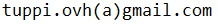

## Available Pages

- [How to calculate LaCrosse TX141TH-BV2 checksum](data_server_stm32/doc_lacrosse.md)  

- [How to build a simple server for sensors data](data_server_stm32/doc_data_server.md) 

- [Smart Home statistics](smart_stats.md)  

## Compatibility Pages 

- [Link #1](doc_lacrosse.md)  

- [Link #2](doc_data_server.md) 

## Contact

If you have any suggestions about the content of this site, 
you can contact me on this e-mail: 

